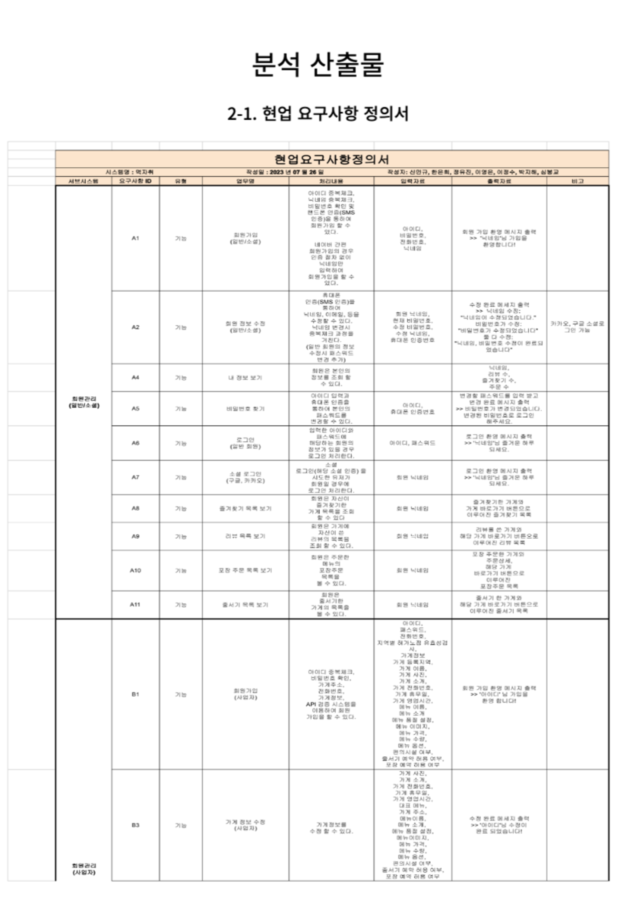
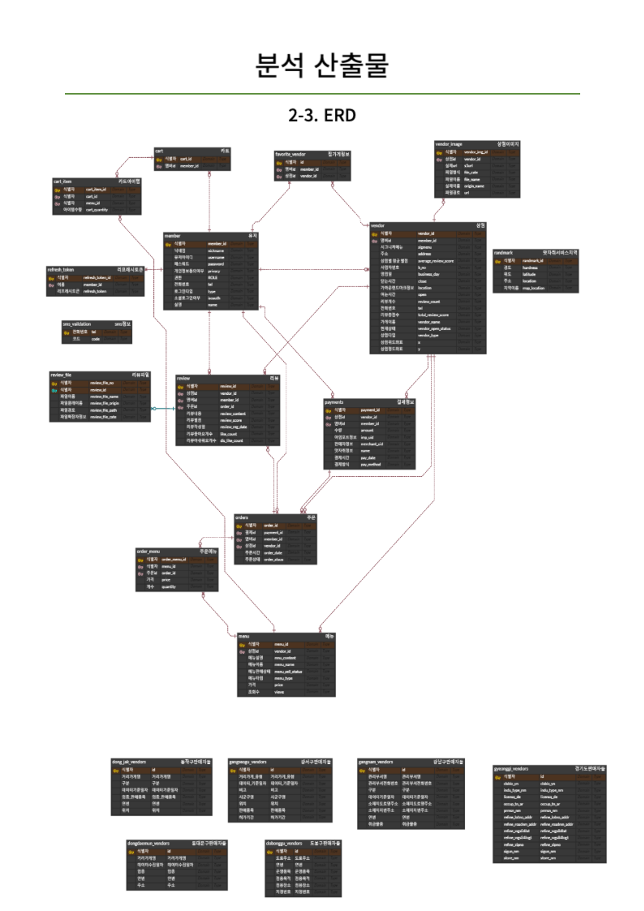
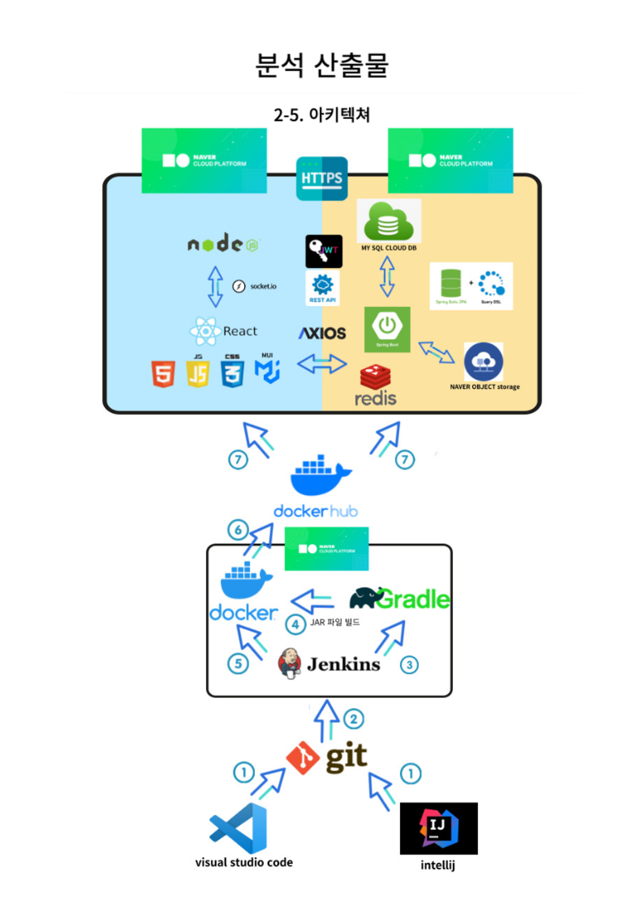
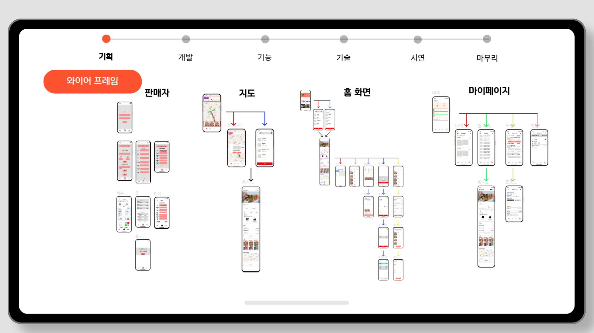
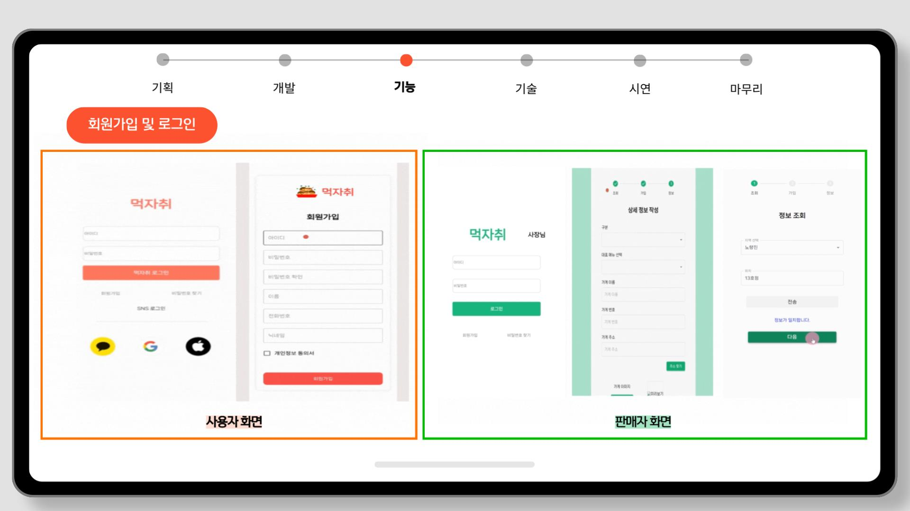
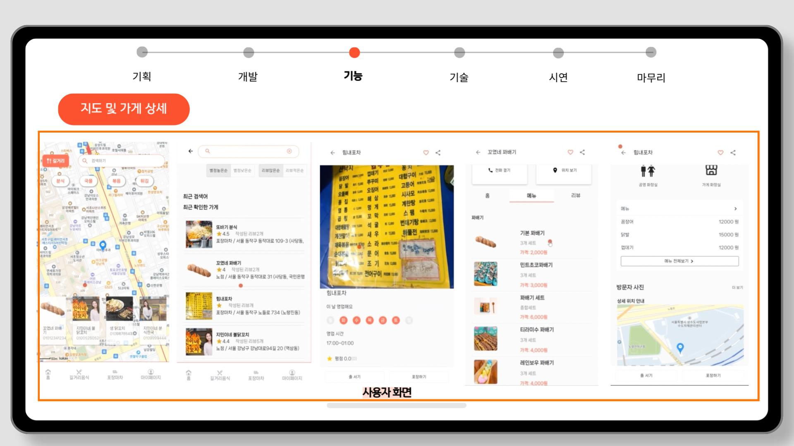
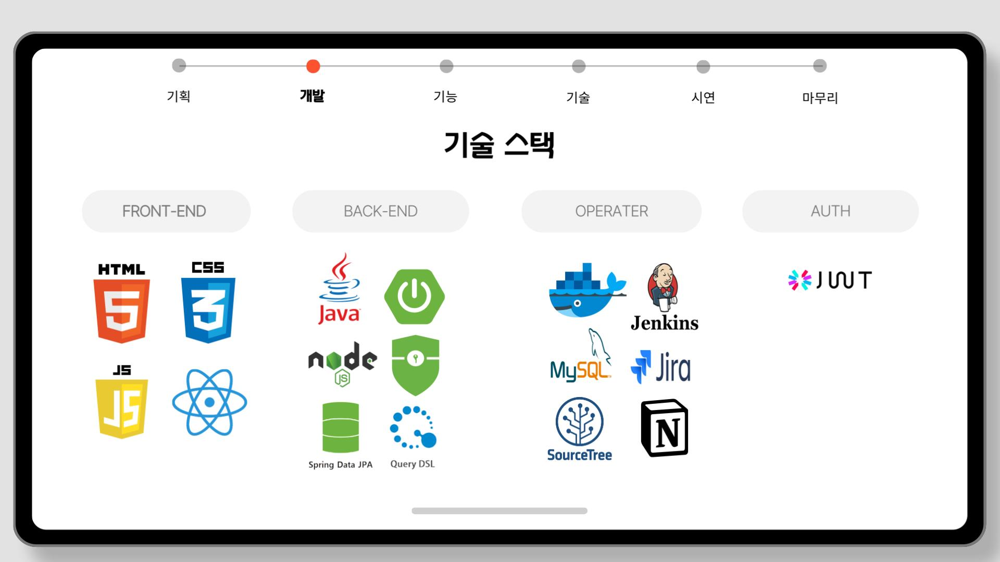

## ✏️  간략한 소개

---

비트캠프에서 주최하는 [네이버클라우드] full-stack 개발자 과정에서 파이널 프로젝트를 진행하였습니다.

### **프로젝트 제작 배경**

길거리 음식은 생활에서 쉽게 접할 수 있는 일상의 일부입니다. 그러나 특정 길거리 음식을 찾기 위해 검색을 해도, 정보가 부정확하거나 아예 정보를 찾을 수 없는 경우가 빈번합니다. 이러한 정보의 분산과 부재가 초래하는 불편을 해소하기 위해 이 **프로젝트**를 **시작**하게 되었습니다.

## 💡  개발 문서

  
  
  

## 🔎  담당 상세 내용

---

<aside>
🐦 회원가입 및 로그인

1. [유저] 회원가입 정보를 지정된 API로 전송합니다.
2. [사장님] 입력 정보와 노점API의 데이터를 비교하기 위해 검증 API를 호출합니다. 일치하는 경우에만 회원가입이 가능하도록 구현했습니다.
</aside>

---

<aside>
🐦 지도

1. 카카오 맵 API를 활용하여 등록된 정보의 x, y 좌표 값을 마커로 생성하고 지도에 표시하였습니다.
    

이 과정에서 지도 코드가 복잡해지는 문제가 발생했으나, 커스텀 훅과 컴포넌트 분리를 실시하여 코드의 가독성과 유지보수성을 향상시켰습니다.

</aside>

## 📖  사용 기술

## 📝  역할 및 책임

- **조장 (프로젝트 총괄)**
    - 프로젝트의 전체적인 흐름과 일정 관리
- **판매자, 유저 로그인 및 회원가입 (JWT)**
    - 판매자와 유저의 로그인 및 회원가입 기능 → 백엔드와 통신(JSON Web Token 사용)
- **길거리 음식 (카카오 맵 API 노점 마커 생성)**
    - 카카오 맵 API를 활용해 길거리 음식 노점의 위치를 마커로 표시
- **가게 정보 클릭 시 지도로 이동**
    - 선택한 가게 정보를 클릭하면 해당 위치로 지도가 이동
- **프론트엔드 코드 정리 및 Git 관리**
    - 코드의 가독성과 유지보수를 위한 정리, Git을 통한 버전 관리
- **Support (부가 기능)**
    - **결제 API 구현**: 온라인 결제 시스템(i’mport)을 통한 결제 기능 추가
    - **사장님(가게)별로 리뷰 기능 수정**: 사용자가 각 가게별로 리뷰를 볼 수 있도록 기능을 수정
    - **API에서 전송되는 이미지 경로 수정**: 이미지 경로에 관한 문제를 해결
    - **비밀번호 찾기**: 네이버 SMS API를 활용해 이름과 전화번호가 일치할 경우 인증번호를 전송, 인증번호 일치 시 비밀번호 재설정 가능
    - **View UI 개선**: 직관적인 화면을 표출하기 위한 UI 개선 작업
- **프로젝트 발표 및 PPT 제작**
    - 프로젝트의 결과를 체계적으로 정리하여 발표 자료 생성과 실제 발표 진행
    

    
    ## 📝  회고
    

    
     리액트를 처음 접하고 프로젝트를 시작하면서, 기존에 알고 있던 Thymeleaf 문법과 HTML의 구조적 차이로 초기에 **어려움**을 겪었습니다. 이를 극복하기 위해 매일 2시간씩 온라인 강의를 들으며, 특히 **Hooks**와 **렌더링 최적화**에 집중했습니다.
    
     그러나 이론과 실전은 다르다는 것을 느꼈습니다. **렌더링 속도가 느려지는 문제**와 **Git에서의 병합 충돌, 코드 덮어쓰기** 등 다양한 문제에 부딪혔습니다. 이러한 문제들을 해결하기 위해 Git에서는 문제가 발생한 커밋을 **역추적**하여 코드를 복구했고, 렌더링 속도 문제도 **API 호출 구조를 개선**하여 해결했습니다.
    
     프로젝트를 진행하면서 아쉬운 부분들도 많았지만, 이 과정에서 **웹의 구조, 접근성,** **CORS 문제,** 그리고 **브라우저 동작 원리**에 대한 **실질적인 경험**을 쌓을 수 있었습니다.
